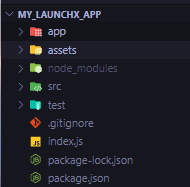
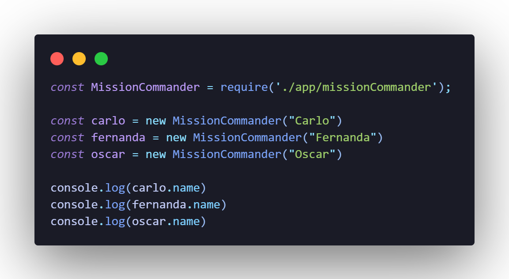
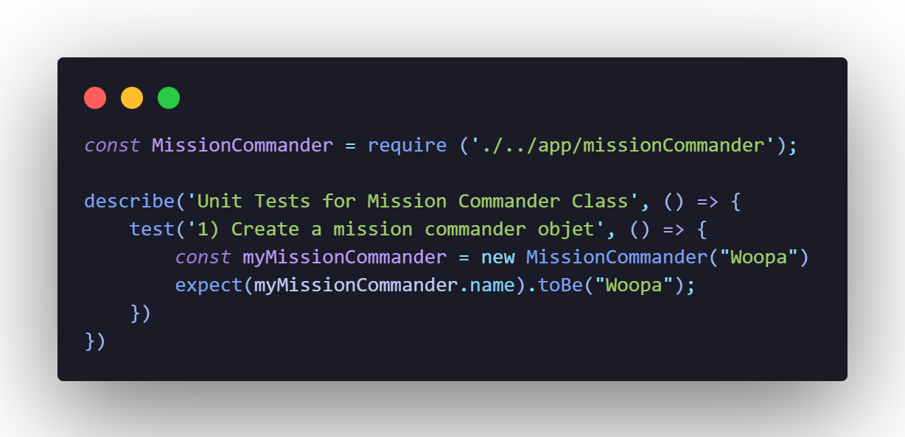

# Semana 3 - Proyecto 1: Creación de Proyectos en JS

1. Crear nuevo proyecto de JS
Así como directorios y archivos para organizar nuestro código. Así como inicializaremos nuestro proyecto JavaScript con el comando *`npm init`*, dando como resultado la creación del archivo *package.json*  

2. Agregar dependencias
En el archivo package.json se agregarán las dependencias necesarias, en este caso solo utilizaremos jest. Así que haremos uso del comando *`npm install --save-dev jest`*. (Esto indica que se agrega la dependencia jest, y que se agrega para el ambiente de desarrollo --save-dev). Así como también se creara la carpeta *`node_modules`*.
3. Creación de una clase y modularización
En las carpetas app se creará un archivo *missionCommander.js* y así como una clase *MissionCommander* junto a su constructor donde solo recibirá un parámetro y lo agregue en el atributo *name*. Y se exportará la clase.  
  

En el archivo index.js importamos la clase, se instancia la clase en 3 objetos y se imprime el atributo name.  
  

En el archivo package.json, en la parte de scripts escribimos la siguiente línea de código:
```js
 "start": "node index.js"

```
Y con el comando *`npm start`* podemos ejecutar el archivo index.js, en pocas palabras es como si estuvieramos ejecutando el comando *`node index.js`*.

4. Agregar una prueba de unidad de la clase
En el archivo package.json se modifica la siguiente línea de código que empieza con *`test`*, por:
```
"test": "node --experimental-vm-modules ./node_modules/jest/bin/jest.js"
```

*Nota:* Esto aplica para sistemas operativos Windows.

Y una vez listo empezamos a crear nuestra prueba, la cual consiste en recibir el parámetro y se agregará en el atributo *name*.

* Primero debemos de importar la clase la clase de la cual se hará la prueba.
* Después modificamos la descripción de la prueba.
* Instanciamos un objeto a partir de clase importada.
* Con el *expect* se agregará la propiedad que se probará y en el *expect*, el resultado que se espera obtener.

  

Por último ejecutamos la prueba con el comando *`npm test`* o en caso que tuvieramos más archivos de pruebas podemos especificar el nombre del archivo para evitar ejecutar todas las pruebas a la vez.